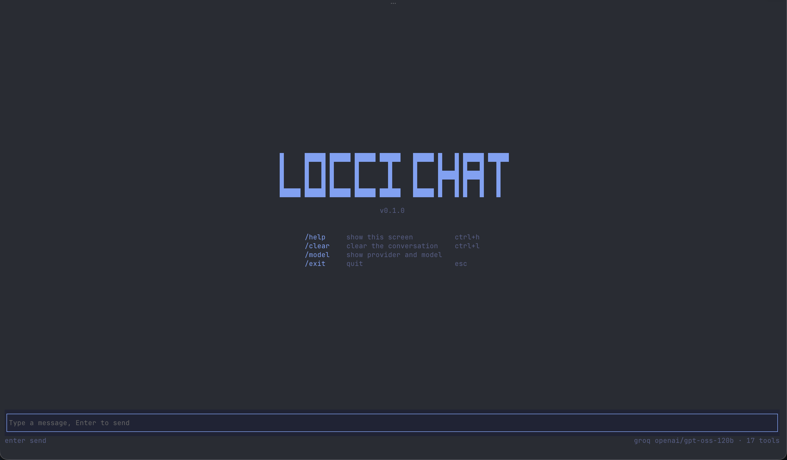

# Locci Chat CLI



A self-hosted AI assistant you run on your own machine. A local Express service holds your provider credentials and talks to the model; two clients talk to it — a streaming terminal chat and a full-screen TUI. Any number of MCP servers can be plugged in, giving the model real tools: your filesystem, a sandbox, or anything else that speaks MCP.

- **Multi-provider** — Anthropic, OpenAI or Groq, selected by environment, no code change.
- **Real tools** — connects to any number of stdio MCP servers, merges their tools, and runs a multi-step tool loop so the model can act and then keep going.
- **Visible work** — tool calls surface live in both clients, with expandable detail.
- **Degrades, doesn't crash** — a broken MCP server, an unparseable config, a provider outage or a dead key each reduce capability and report clearly, rather than taking the service down.

## Requirements

Node 18+ for the service and the CLI. The TUI additionally needs [Bun](https://bun.sh), which its renderer depends on.

## Setup

```bash
npm install
cp .env.example .env      # add the API key for the provider you want
cp mcp.example.json mcp.json   # optional — enables MCP tools
```

Run the service, then a client:

```bash
# terminal 1
npm run server

# terminal 2 — health check
npm run status

# streaming terminal chat
npm run chat

# or the full-screen TUI
npm run tui

# with a system prompt
npm run cli -- chat -s "You are a code assistant."
```

## Configuration

| Variable                   | Purpose                                                 |
| -------------------------- | ------------------------------------------------------- |
| `PROVIDER`                 | `anthropic` \| `openai` \| `groq` (default `anthropic`) |
| `MODEL`                    | Model id; falls back to a per-provider default          |
| `ANTHROPIC_API_KEY` etc.   | Key for the selected provider                           |
| `PORT` / `API_URL`         | Service port, and where clients look for it             |
| `MCP_CONFIG`               | MCP config path (default `./mcp.json`)                  |
| `MCP_ENABLED`              | `1` forces MCP on, `0` forces it off                    |
| `MCP_COMMAND` / `MCP_ARGS` | Single-server fallback when there's no config file      |

`PROVIDER` and `MODEL` must agree — pointing `PROVIDER=groq` at an Anthropic model id will fail at request time, not at boot.

**Anthropic keys:** the provider needs an `ANTHROPIC_API_KEY` from the [Anthropic Console](https://console.anthropic.com), billed against API credits. A claude.ai **Pro** subscription is a separate product — its login doesn't issue an API key and its balance doesn't apply to API usage, so a Pro plan can't authenticate this.

## Health check

`npm run status` reports the provider, model and every configured MCP server, then makes a live call to confirm the key and credits actually work. It exits non-zero on failure, so it works as a readiness probe:

```
   provider: groq
   model:    openai/gpt-oss-120b
   mcp:      ✓ fs — 14 tool(s)
             ✗ broken — spawn definitely-not-a-real-binary ENOENT
   tools:    14 merged
✅ API key works.  reply: "OK"
```

A failure prints the exact provider error — e.g. `401 Invalid API Key`, or a credit balance message — rather than a generic "couldn't connect".

## Terminal chat

`npm run chat` is a line-based streaming client. History is kept for the session and sent each turn. Type `/exit` to quit (exit 0), or press `Ctrl+C` (exit 130) — that aborts any in-flight request, closes readline and restores the terminal instead of dying mid-stream.

Tool activity appears as muted lines as it happens:

```
AI Assistant >
· using List Allowed Directories…
· List Allowed Directories ok
Allowed directories: /tmp, /private/tmp
```

## TUI

`npm run tui` opens the full-screen client: a `LOCCI CHAT` splash over a bordered composer, with the live provider, model and tool count in the footer. Your turns render in a tinted block behind a pink accent gutter; the agent's sit on a neutral grey block.

Answers are **rendered Markdown**, not raw text. [satteri](https://satteri.bruits.org) parses them via `markdownToMdast` and the mdast maps onto OpenTUI's inline elements, so headings, bold, italic, inline code, links, fenced code blocks, lists, blockquotes, rules and tables all display styled. We stop at mdast rather than `markdownToHtml` because there's no HTML to re-parse for a terminal. A parse failure falls back to plain text.

Typing `/` opens a completion menu above the composer, sharing its background and borders so the two read as one panel. It filters by prefix as you type; `↑`/`↓` move, `tab` completes, `enter` runs the highlighted entry, `esc` closes it (a second `esc` quits).

| Command  |                         | Shortcut         |
| -------- | ----------------------- | ---------------- |
| `/help`  | show the splash         | `ctrl+h`         |
| `/clear` | clear the conversation  | `ctrl+l`         |
| `/model` | show provider and model |                  |
| `/exit`  | quit                    | `esc` / `ctrl+c` |

The layout is width- and height-aware: the wordmark drops from one line to stacked to plain text, the command table collapses to a single row, and the footer hint hides before it can collide — so nothing wraps or shifts the chrome on a small terminal.

### Tool calls

Tool calls appear inline in the transcript, in the order they happened. While one runs it shows as a muted `⋯ Using Read File…`; once it returns it collapses to a one-line summary with its duration and an argument preview, which acts as an accordion:

```
▸ List Allowed Directories · 0.4s          ← collapsed (ctrl+t opens)
▾ List Allowed Directories · 0.4s          ← expanded
    in  path: /tmp
    out Allowed directories:
        /tmp
```

`ctrl+t` toggles the focused call — by default the most recent one, so what you just watched run is what opens. `ctrl+↑` / `ctrl+↓` move focus between earlier calls; the focused row is tinted. Failed calls render in red with the error in place of the output.

Provider and stream errors render as their own red `✗` line rather than as body text — they aren't something the model said, and they're excluded from the history sent on the next turn.

### Models and tool calling

Tool-call reliability varies a lot by model, and a provider-side rejection surfaces as a red `✗`. Two real examples seen against Groq — both provider validation failures on the model's own output, not a problem with the tools:

- `llama-3.3-70b-versatile`, `qwen/qwen3.6-27b` — `tool_use_failed` / _"Failed to call a function"_, often on the first or second step.
- `openai/gpt-oss-120b` — reliable for short chains, but on longer multi-step loops can emit its `commentary` channel as a tool name: _"attempted to call tool 'commentary' which was not in request.tools"_.

If you hit these, switch models — Anthropic and OpenAI models handle multi-step tool loops more reliably — or shorten the task.

## MCP tools

The service spawns any number of stdio MCP servers at boot and hands their tools to the model. Declare them in a JSON file using the same `mcpServers` schema Claude Desktop and Cursor use, so the output of `loccibox mcp config` pastes straight in:

```json
{
  "mcpServers": {
    "loccibox": { "command": "loccibox", "args": ["mcp", "start"] },
    "filesystem": {
      "command": "npx",
      "args": ["-y", "@modelcontextprotocol/server-filesystem", "/tmp"],
      "env": { "SOME_VAR": "value" },
      "disabled": false
    }
  }
}
```

Per server: `command` (required), `args` (default `[]`), `env` (merged over `process.env`), `disabled` (default `false`). Unknown fields are ignored, so a config written for a newer schema still loads.

- **Config path** — `MCP_CONFIG`, default `./mcp.json`, resolved from the cwd.
- **Enabling** — MCP turns on when an `mcp.json` exists _or_ `MCP_ENABLED=1`; `MCP_ENABLED=0` forces it off.
- **Fallback** — with no usable config, `MCP_COMMAND` / `MCP_ARGS` connect a single server. With neither, the service starts with no tools and chat still works.
- **Failures degrade** — servers connect concurrently and independently; a bad `command` is logged as failed while every other server keeps working.
- **Collisions** — when two servers expose the same tool name, the colliding keys are prefixed with `<server>_`. Unique names are left untouched.

Inspect what's configured and what each server exposes:

```bash
npm run cli -- mcp list
```

## HTTP API

| Endpoint      | Purpose                                                            |
| ------------- | ------------------------------------------------------------------ |
| `POST /chat`  | Streaming chat. Body `{ messages, system? }`                       |
| `GET /status` | Wiring report **plus** a live key check (used by `npm run status`) |
| `GET /info`   | Same wiring report with **no** API call — cheap enough to poll     |

`POST /chat` streams plain text by default. With **`?events=1`** it streams NDJSON instead, one JSON object per line, so a client can show tool activity live:

```json
{ "t": "text",       "v": "partial text" }
{ "t": "tool",       "id": "…", "name": "read_file", "title": "Read File" }
{ "t": "tool-input", "id": "…", "input": { "path": "/tmp" } }
{ "t": "tool-done",  "id": "…", "output": "…" }
{ "t": "error",      "v": "…" }
```

`tool` is emitted the moment the model commits to a call, before its arguments finish streaming — that's what lets a client say "Using x…" immediately. Tool payloads are capped at 4 KB. Both bundled clients opt in; anything hitting `/chat` without the flag gets the plain text stream.

## Shutdown

On `SIGTERM`/`SIGINT` the HTTP server drains first — idle connections close immediately, active streams get five seconds, then the rest are forced — and only then does each MCP client close, one `mcp: <server>` at a time. Cleanup is capped at ten seconds overall, so shutdown can't hang indefinitely.

## License

Licensed under the Apache License, Version 2.0. See [LICENSE.md](LICENSE.md).
